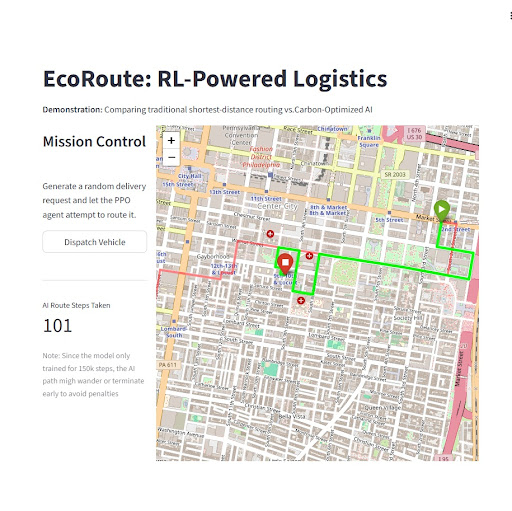

# EcoRoute: RL-Powered Logistics Optimizer


**EcoRoute** is an experimental Deep Reinforcement Learning pipeline that routes delivery vehicles based on **carbon emission heuristics* rather than purely shortest-distance algorithms.

Instead of traditional graph-search methods (like A* or Dijkstra), this project trains a **Proximal Policy Optimization (PPO)** agent to navigate a custom geospatial Gymnasium environment built dynamically from real-world OpenStreetMap data of Philadelphia, PA.



## System Architecture

EcoRoute is built entirely from scratch without reliance on paid APIs or AI wrappers.

1. **Data Engineering (`osmnx` + `networkx`):** Dynamically downloads city grids and imputes traffic speeds to calculate a custom `carbon_cost` edge weight (penalizing stop-and-go residential streets and high-drag highway speeds).
2. **Custom Environment (`gymnasium`):** A strictly validated RL environment featuring dense reward shaping (Euclidean distance-to-goal) and "Lane Assist" mathematics to prevent the agent from taking invalid intersections.
3. **The Agent (`stable-baselines3`):** A PPO agent utilizing continous spatial embeddings to navigate complex directed multi-graphs.
4. **Deployment (`streamlit` + `folium`):** An interactive dashboard comparing traditional shortest-path routing aainst the AI's carbon optimized exploration.

## Research & Architecture Insights

Training an RL agent to navigate a highly complex, directed multi-graph (a city with one-way streets) is difficult. During development, two major architectural hurdles were overcome:

### 1. Solving "Reward Hacking" via Spacial Embeddings
Initially, the observation space was defined by discrete node IDs (e.g., `[start_node, end_note]`). Lacking spatial awareness, the agent intentionally crashed at the first intersection to minimize its penalties.
* **The Fix:** Re-architected the observation space into a 7-dimensional continous vector representing normalized Lat/Lon coordinates, directional headings (`delta_x`, `delta_y`), and Euclidean distance. The agent successfully transitioned from reward-hacking to actively exploring 200+ intersections per episode.

### 2. Architecture A/B Test: Compute vs. Sample Efficiency
To solve the agent's tendency to get trapped in local minima (pacing back and forth), an A/B test was conducted between a memoryless Multi-Layer Perceptron (`MlpPolicy`) and a Recurrent LSTM (`MlpLstmPolicy`).
* **`MlpPolicy` (1,000,000 steps):** Highly compute-efficient (~15 minutes). Balanced exploration with decent pathfinding, though occsionally susceptible to memoryless loops.
* **`MlpLstmPolicy` (500,000 steps):** Highly sample-efficient but compute-heavy (~52 minutes). The LSTM successfully solved the "amnesia" problem and survived significantly longer per episode, but racked up heavy carbon penalities by exploring massive detours.
* **Verdict:** For standard local compute budgets, the 1M-step standard MLP provides the optimal balance of inference speed and routing accuracy.

## Quick Start

This repository includes a fully configured `.devcontainer` for instance, reproducible deployment.

```bash
# 1. Clone the repository and install dependencies
git clone https://github.com/ryan-tobin/EcoRoute
cd ecoroute
pip install -r requirements.txt

# 2. Generate the map data (Downloads Center City, Philadelphia)
python src/graph/map_processor.py

# 3. Train the PPO Agent (Default: 1M steps)
python -m src.engine.agent

# 4. Launc the Dashboard
streamlit run dashboard/app.py
```

## Future Work
* Graph Neural Networks (GNNs): Transitioning from Lat/Lon spatial embeddings to structural node embeddings to give the agent inherent topological awareness of the road network.
* Multi-Agent Systems: Simulating a fleet of vehicles simultaneously competing for optimal routes without causing congestion.